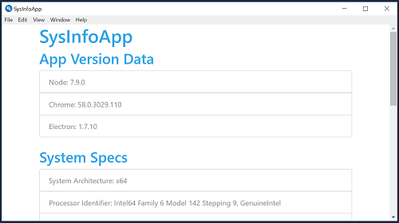

# Electron System Info App
This project is the result of my code-along at the end of the video [An Intro To Electron - Desktop Apps with JavaScript](https://www.youtube.com/watch?v=mr9Mtm_TRpw) by *Brad Traversy*.

     

## Versions Used
* Node v9.4.0
* Electron v1.7.10

## Installing the Project
To install this project, perform the following tasks:

1. Clone this repo: `git clone https://github.com/Stanza987/electron-sysinfoapp.git`
1. `cd` into the folder of the cloned repo
1. Run `yarn install` to install dependencies
1. Run `yarn start` to run the app
